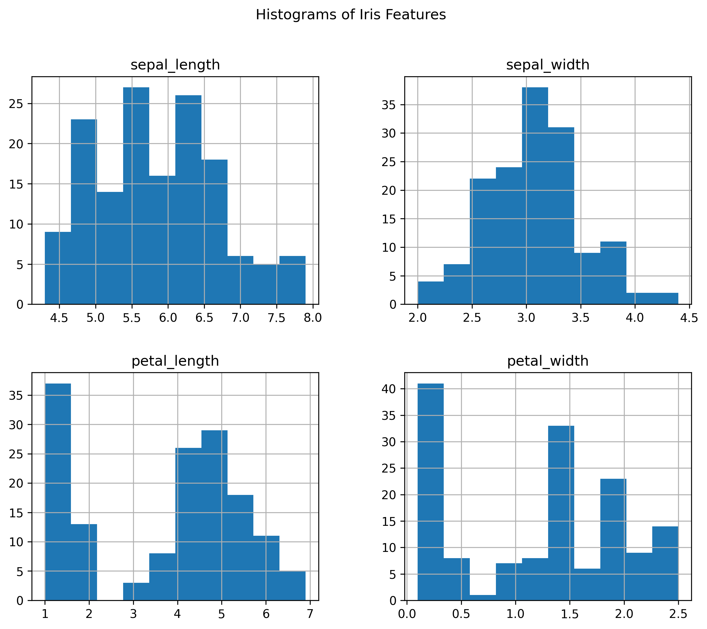
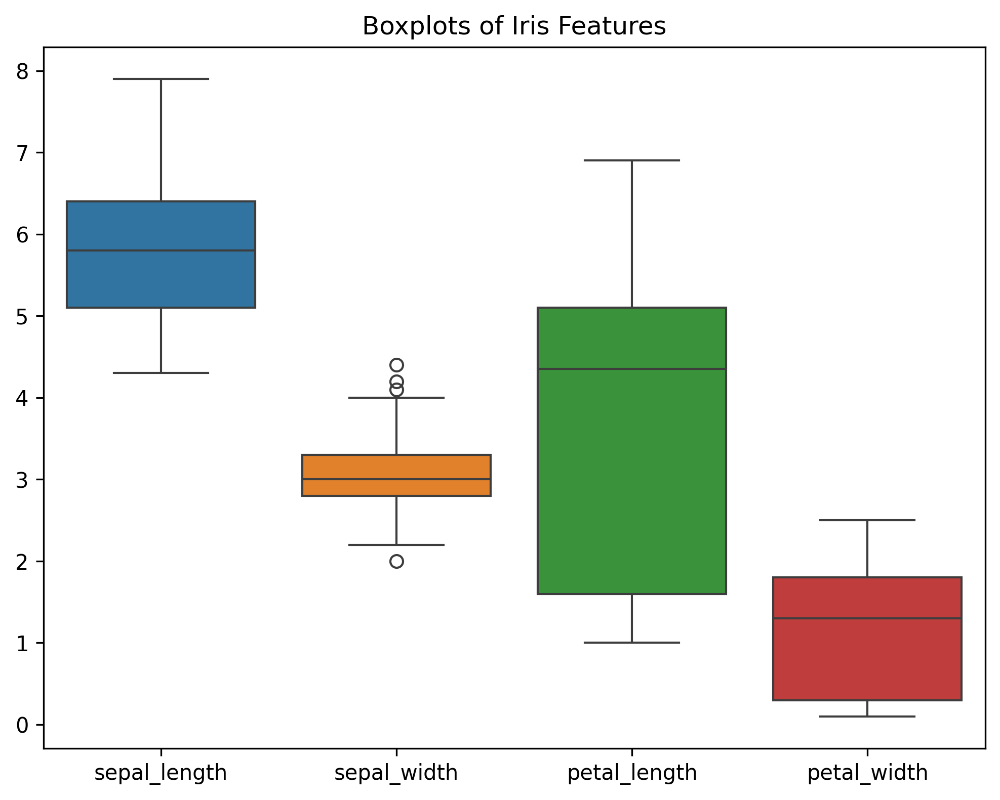
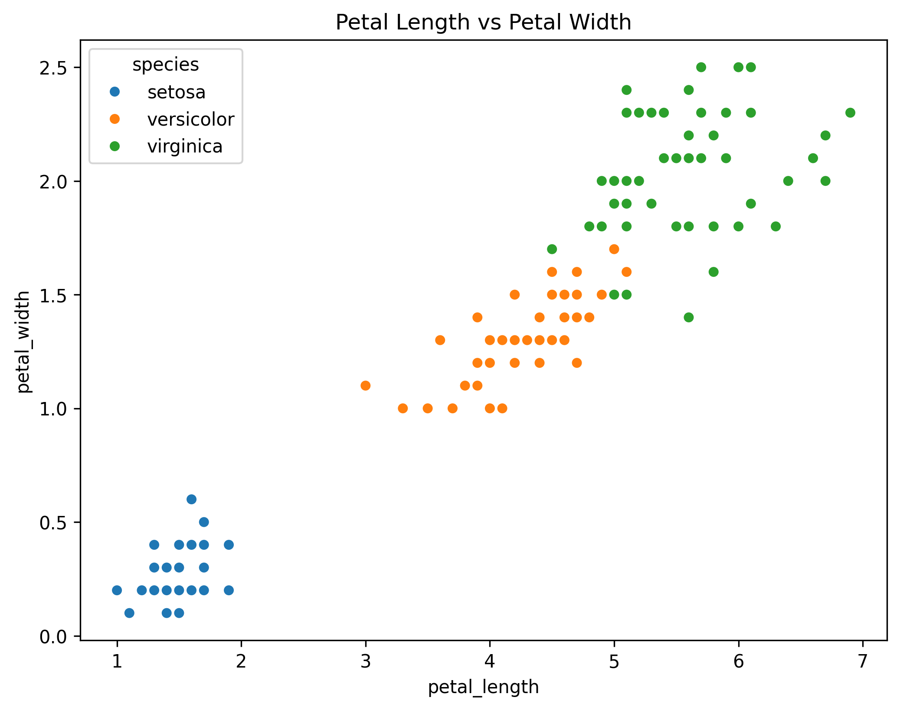
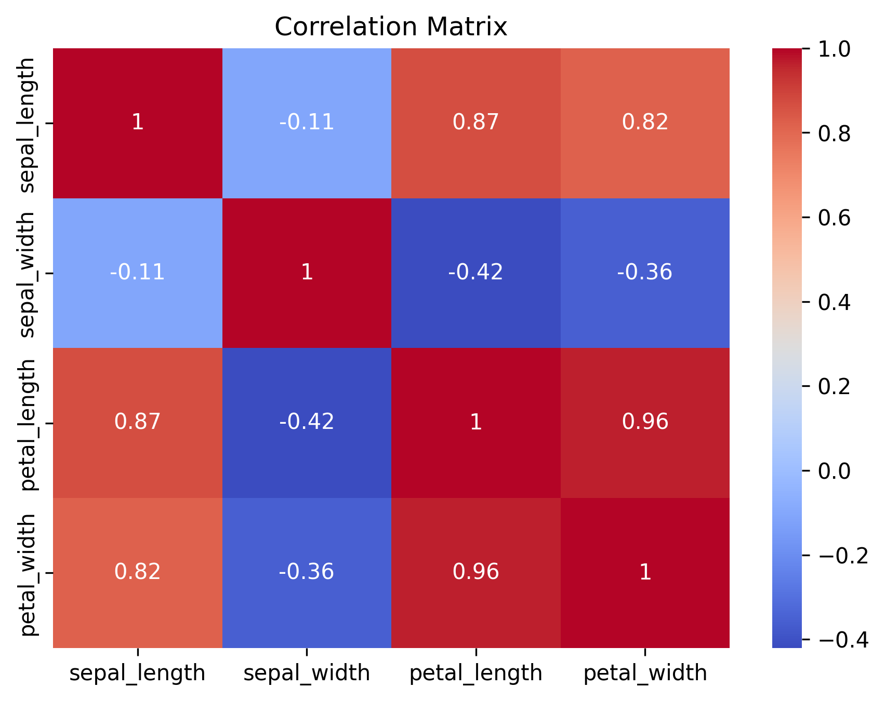

# 📊 Exploratory Data Analysis (EDA)

## 📌 Project Overview

This project explores the famous Iris dataset using Python.

The objective is to analyze the dataset, understand feature distributions, discover relationships between variables, and visualize important insights.

---

## 🛠 Tools Used

- Python
- Pandas
- Matplotlib
- Seaborn
- Google Colab

---

## 📂 Dataset

The dataset contains 150 iris flower samples with four numerical features:

- Sepal Length
- Sepal Width
- Petal Length
- Petal Width

Target variable:

- Species

---

# 📈 Histogram

Shows the distribution of all numerical features.

---

# 📦 Boxplot

Displays spread and possible outliers.

---

# 🎯 Scatter Plot

Relationship between Petal Length and Petal Width.

---

# 🌡 Correlation Heatmap

Shows correlation between numerical variables.

---

# 📌 Key Insights

- The Iris dataset contains no missing values.
- Petal measurements are more informative than sepal measurements.
- Petal Length and Petal Width have a very strong positive correlation.
- Iris species can be visually separated using petal features.
- The dataset is suitable for machine learning classification.

---

## 👨‍💻 Author

**Taha Ahmed Khallaf**

Codveda Data Analytics Internship
